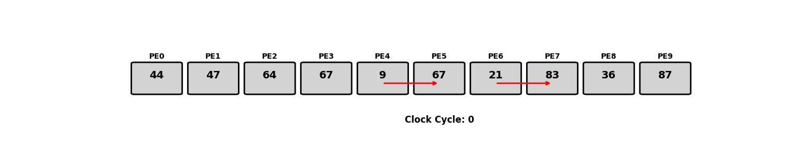
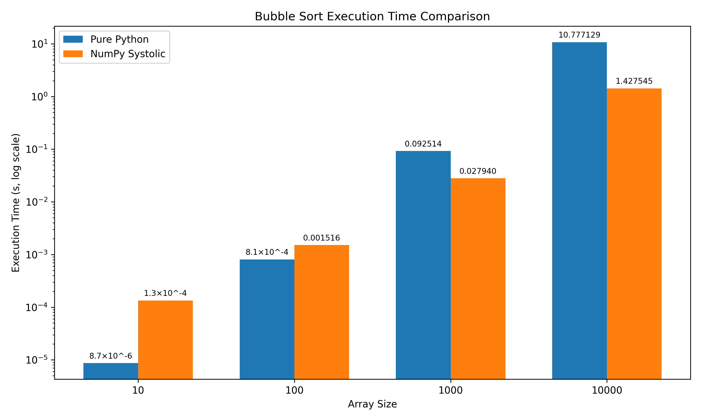

# W05_C17_BubbleSort_Systolic_Array
Course: HW for AI &amp; ML, Week 5 Challenge 17, Benchmarking Bubble sort on a systolic array.

---

# **Systolic Array-Based Bubble Sort**

## **TL;DR**

- This project compares the performance of a traditional **pure Python implementation** of Bubble Sort with a **NumPy-based systolic array simulation**. 
- The speedup is primarily due to **NumPy's optimized C backend**, which allows for efficient memory access and computation and not because of the systolic array simulation itself.
- The systolic array simulation is a **conceptual exercise** to understand how data flows in hardware architectures, but the actual performance gain comes from using NumPy's efficient array operations.
- Each excecution block runs parallely in actual Hardware implementation of Systolic Array.
- In this simulation, each execution block runs sequentially, but the systolic array concept is still applied to understand how data flows through the array.

- The results clearly demonstrate that the NumPy systolic version significantly outperforms the pure Python implementation for larger input sizes — up to **7×–8× faster** for size 10000.

- The average execution times (in seconds) for different input sizes are:

    | Input Size | Python (Pure) | NumPy (Systolic) |
    | ---------- | ------------- | ---------------- |
    | 10         | 8.66×10⁻⁶     | 1.34×10⁻⁴        |
    | 100        | 8.09×10⁻⁴     | 1.52×10⁻³        |
    | 1000       | 0.0925        | 0.0279           |
    | 10000      | 10.77         | 1.43             |

- For very small arrays (e.g., size 10), the pure Python version is faster simply due to **low overhead**. But as the array size increases, the **vectorized operations** in the NumPy version dominate and drastically reduce execution time.


---

## **Background: What is a Systolic Array?**

- A **systolic array** is a hardware-inspired architecture composed of **processing elements (PEs)** that perform computations and pass data to their neighbors in a rhythmic (clock-like) fashion. Unlike Von Neumann CPUs, where data moves to a central processing unit, systolic arrays allow **data to flow between PEs**, enabling **parallelism**, **data locality**, and **low latency**.

- Systolic arrays are ideal for regular, structured computations like **matrix multiplication**, **convolutions**, or **sorting**, where neighboring data elements are frequently compared or combined.

---

## Visualization of a Systolic Array
<div style="text-align: left;">
    
</div>

### Legend
    | Feature           | Behavior                          |
    | ----------------- | --------------------------------- |
    | `PE0`, `PE1`, ... | Label each processing element     |
    | Rounded boxes     | Represent hardware units (PEs)    |
    | Clock cycle label | Indicates current systolic phase  |
    | Red arrows        | Show compare/swap events (wiring) |
    | Bold numbers      | Simulate registers inside PEs     |

### Description
- The diagram above illustrates a **1D systolic array** with 8 processing elements (PEs). 
- Each PE can hold a value and perform compare/swap operations with its right neighbor.
- The diagram is animated to show the **compare/swap** operations happening in **phases**.
- The **red arrows** indicate the compare/swap events, while the **bold numbers** represent the values held in each PE. 
- The **clock cycle label** indicates the current phase of the systolic operation.
- The diagram is a simplified representation of how data flows through the systolic array, mimicking the behavior of hardware PEs.

---

## **Project Tasks and Goals**

The goals of the project are:

1. **Implement Bubble Sort using a standard CPU approach (pure Python).**
2. **Design and simulate a systolic array version of Bubble Sort using NumPy.**
3. **Benchmark both implementations over different input sizes.**
4. **Visualize and analyze performance using a log-scaled bar chart.**

---

## **Implementation Details**

### 1. **Pure Python Bubble Sort**

This version used basic nested loops:

```python
def bubble_sort(arr):
    n = len(arr)
    for i in range(n):
        for j in range(0, n - 1 - i):
            if arr[j] > arr[j + 1]:
                arr[j], arr[j + 1] = arr[j + 1], arr[j]
```

* Time complexity: **O(n²)**
* Easy to implement
* Poor performance for large input sizes due to **sequential nature** and **lack of vectorization**.

---

### 2. **NumPy-Based Systolic Array Simulation**

#### Design Idea

Simulated a **1D systolic array** using NumPy. Each "processing element" (PE) holds one value and can:

* Compare its value with the right neighbor
* Swap values if needed
* This happens in **phases**: even-indexed comparisons, then odd-indexed ones (like hardware clock cycles)

This approximates **wavefront-style propagation** of values — similar to what a systolic array would do.

#### Core Logic

```python
def systolic_bubble_sort_numpy(arr):
    arr = arr.copy()
    n = arr.shape[0]

    for _ in range(n):
        # Even phase
        even_idx = np.arange(0, n - 1, 2)
        left = arr[even_idx]
        right = arr[even_idx + 1]
        mask = left > right
        arr[even_idx[mask]], arr[even_idx[mask] + 1] = right[mask], left[mask]

        # Odd phase
        odd_idx = np.arange(1, n - 1, 2)
        left = arr[odd_idx]
        right = arr[odd_idx + 1]
        mask = left > right
        arr[odd_idx[mask]], arr[odd_idx[mask] + 1] = right[mask], left[mask]

    return arr
```

#### Highlights:

* **Vectorized compare-swap** operations eliminate explicit Python loops.
* Uses `np.arange()` and boolean masking for efficient memory-safe swapping.
* Each phase mimics one clock cycle in a systolic pipeline.
* Implemented over `n` iterations to ensure full sorting convergence.

#### Why this works:

Bubble Sort converges by “bubbling” the largest value to the end in each full pass. Alternating even/odd phase comparisons simulates this behavior in parallel lanes — like a systolic pipeline.

## Why Even-Odd Phases?

### Problem:

We want **each Processing Element (PE)** to:

* **Compare and possibly swap** its value with the **neighbor to its right**.
* But if we try to do this **for all PEs at the same time**, we'll have **conflicts**:

```text
PE0 --- PE1 --- PE2 --- PE3 --- PE4
  ^      ^       ^       ^       ^
Try to swap all at once? Some values get touched twice!
```

### Example:

If PE0 swaps with PE1, and PE1 swaps with PE2 — **which value wins?**
This causes a **data hazard**.

---

## Solution: Even-Odd Phases

We break the work into **two alternating phases**:

### Even Phase:

* Only **even-indexed** PEs compare with their right neighbor:

  * PE0 ↔ PE1
  * PE2 ↔ PE3
  * PE4 ↔ PE5

```text
Phase: EVEN
Compare PE0 ↔ PE1
Compare PE2 ↔ PE3
Compare PE4 ↔ PE5
```

These don’t interfere with each other — clean parallelism.

---

### Odd Phase:

* Only **odd-indexed** PEs compare with their right neighbor:

  * PE1 ↔ PE2
  * PE3 ↔ PE4
  * PE5 ↔ PE6

```text
Phase: ODD
Compare PE1 ↔ PE2
Compare PE3 ↔ PE4
Compare PE5 ↔ PE6
```

As these are disjoint pairs, there is no data conflict.

---

## Real Hardware Interpretation

This is how systolic arrays avoid **bus conflicts or parallel data corruption**:

* Every PE is **only talking to fixed neighbors**
* And only **half the PEs are active per phase**, just like a **hardware pipeline with enable signals**

---

## **Benchmarking Setup**

* For each input size (`10`, `100`, `1000`, `10000`):

  * Each version is run **100 times**
  * **First 2 runs are ignored** (warm-up)
  * Average of the **remaining 98 runs** is recorded
  * All data is logged to a CSV file (`bubble_sort_benchmark.csv`)

---

## **Visualization**

### Plot
<div style="text-align: left;">
    
</div>

### Description

* X-axis: array sizes
* Y-axis: execution time (seconds)
* Each size has two vertical bars:

  * **Blue**: Pure Python
  * **Orange**: NumPy Systolic
* Exact timings are annotated above each bar (in decimal or scientific notation)

---

## 📁 **Files and Structure**

* `bubble_sort_python.py` – pure Python implementation
* `bubble_sort_systolic_cpu.py` – NumPy systolic simulation
* `bubble_sort_systolic_cpu_visualize.py` – visualization script to generate the systolic array animation
* `bubble_sort_benchmark.csv` – output data
* `plot_benchmark.py` – visualization script
